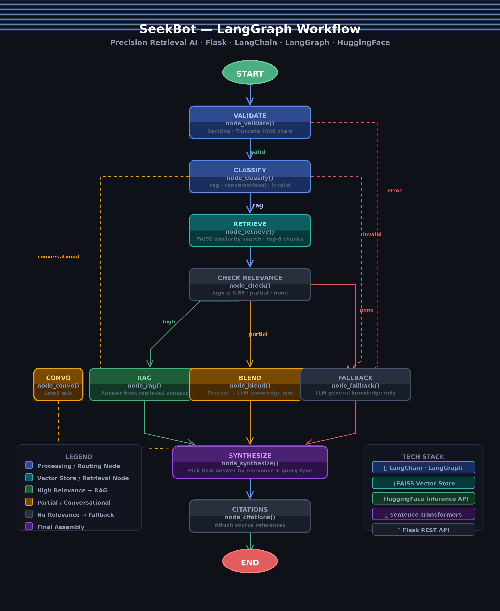
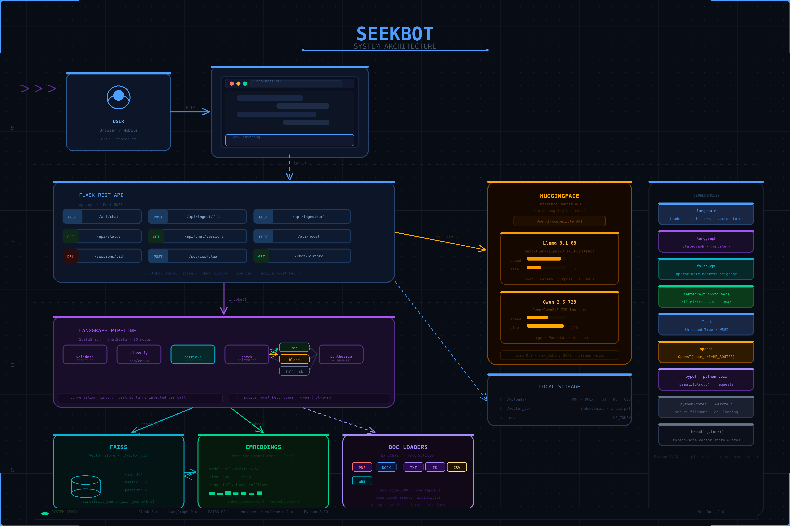

# 🔍 SeekBot — Precision Retrieval AI

**SeekBot** is a precision retrieval AI that lets you seek answers from your own documents using state-of-the-art open-source LLMs via the HuggingFace Inference API.

---

## 📸 Workflow Overview



---

## ✨ Features

- 📄 **Multi-format document ingestion** — PDF, DOCX, TXT, Markdown, CSV
- 🌐 **Web URL ingestion** — scrape and index any public webpage
- 🧠 **Semantic search** with FAISS vector store (local, persistent)
- 🔀 **Intelligent query routing** via LangGraph state machine
- 🤖 **Multi-model support** — switch between Llama 3.1 8B and Qwen 2.5 72B at runtime
- 💬 **Conversation memory** — maintains last 10 turns of context
- 💾 **Persistent sessions** — save, reload, and delete chat sessions
- 🔒 **Fully local embeddings** — `all-MiniLM-L6-v2` via `sentence-transformers` (no API key needed for embeddings)
- ⚡ **Thread-safe** vector store with FAISS persistence across restarts

---

## 🏗️ Architecture





---

## 🔀 LangGraph Pipeline — Node Reference

The core of this application is a **LangGraph StateGraph** that routes each query through a series of intelligent nodes:

| Node | Function | Description |
|------|----------|-------------|
| `validate` | `node_validate()` | Sanitizes and truncates query (max 4000 chars). Emits error on empty input. |
| `classify` | `node_classify()` | Calls the LLM to classify query as `rag`, `conversational`, or `invalid`. |
| `retrieve` | `node_retrieve()` | Runs semantic search against FAISS. Returns top-6 chunks with similarity scores. |
| `check` | `node_check()` | Evaluates relevance level: `high` (avg score ≥ 0.65), `partial`, or `none`. |
| `rag` | `node_rag()` | Generates answer using **retrieved context only**. Used when relevance is `high`. |
| `blend` | `node_blend()` | Blends document context with LLM general knowledge. Used for `partial` relevance. |
| `fallback` | `node_fallback()` | Answers entirely from LLM general knowledge. Used when no relevant docs found. |
| `convo` | `node_convo()` | Handles small talk and greetings with a friendly system prompt. |
| `synthesize` | `node_synthesize()` | Picks the correct answer field based on query type and relevance level. |
| `citations` | `node_citations()` | (Reserved) Returns final answer with empty citation list. |

### Routing Logic

```
START → validate
         │
    ┌────┴──────┐
  error      classify
              │
    ┌─────────┼─────────┐
   rag   conversational  invalid
    │          │           │
 retrieve    convo      synthesize
    │
  check
    │
  ┌─┼──────────┐
high  partial  none/low
 │      │        │
rag   blend   fallback
 └──────┴────────┘
         │
     synthesize → citations → END
```

---

## 🚀 Quick Start

### 1. Clone & Install

```bash
git clone https://github.com/vbek/SEEKBOT.git
cd seekbot
pip install flask python-dotenv openai langchain langchain-community langchain-text-splitters langgraph pypdf python-docx beautifulsoup4 requests faiss-cpu sentence-transformers
```

### 2. Configure Environment

Create a `.env` file in the project root:

```env
HF_TOKEN=your_huggingface_token_here
```

> Get your token at [https://huggingface.co/settings/tokens](https://huggingface.co/settings/tokens)  
> Create a **fine-grained token** with `"Make calls to Inference Providers"` permission.

### 3. Run

```bash
python app.py
```

Open your browser at [http://localhost:5000](http://localhost:5000)

---

## 📁 Project Structure

```
rag-chatbot/
├── app.py              # Main Flask + LangGraph application
├── templates/
│   └── index.html      # Frontend chat UI
├── uploads/            # Uploaded documents (auto-created)
├── vector_db/          # Persisted FAISS index (auto-created)
├── .env                # HuggingFace API token (not committed)
├── .gitignore
└── README.md
```

---

## 🌐 API Reference

| Method | Endpoint | Description |
|--------|----------|-------------|
| `GET` | `/` | Serve the chat UI |
| `GET` | `/api/status` | Current model, sources, chunk count |
| `POST` | `/api/chat` | Send a query, receive an answer |
| `GET` | `/api/chat/history` | Get current conversation history |
| `POST` | `/api/chat/reset` | Save current chat and start fresh |
| `GET` | `/api/chat/sessions` | List all saved sessions |
| `GET` | `/api/chat/sessions/<id>` | Load a saved session |
| `DELETE` | `/api/chat/sessions/<id>` | Delete a session |
| `POST` | `/api/ingest/file` | Upload and index a document |
| `POST` | `/api/ingest/url` | Scrape and index a URL |
| `POST` | `/api/sources/clear` | Clear all indexed sources |
| `POST` | `/api/model` | Switch the active LLM |

### Example: Chat Request

```bash
curl -X POST http://localhost:5000/api/chat \
  -H "Content-Type: application/json" \
  -d '{"query": "What does the document say about neural networks?"}'
```

### Example: Ingest a File

```bash
curl -X POST http://localhost:5000/api/ingest/file \
  -F "file=@/path/to/your/document.pdf"
```

---

## 🤖 Supported Models

| Key | Model | Description |
|-----|-------|-------------|
| `llama` | `meta-llama/Llama-3.1-8B-Instruct` | Meta · Fast & general purpose |
| `qwen` | `Qwen/Qwen2.5-72B-Instruct` | Alibaba · Large & powerful |

Switch models at runtime via the UI or API:

```bash
curl -X POST http://localhost:5000/api/model \
  -H "Content-Type: application/json" \
  -d '{"model_key": "qwen"}'
```

---

## 🧩 Technical Details

### Embeddings
- Model: `all-MiniLM-L6-v2` (sentence-transformers)
- Dimension: 384
- Runs **fully locally** — no API key required
- Downloads ~90MB on first run, then cached

### Document Chunking
- Splitter: `RecursiveCharacterTextSplitter`
- Chunk size: **1000 tokens**
- Overlap: **150 tokens**
- Separators: `\n\n`, `\n`, `. `, ` `, `""`

### Relevance Scoring
Cosine similarity scores are normalized. Thresholds:

| Level | Condition | Behavior |
|-------|-----------|----------|
| `high` | avg score ≥ 0.65 | Full RAG answer |
| `partial` | 0.25 ≤ avg < 0.65 | Blended answer |
| `none` | avg < 0.25 | Pure LLM fallback |

---


## 📜 License

- This project is licensed under the **MIT License** — see the [LICENSE](LICENSE) file for details.
- In short: you're free to use, modify, and distribute this software, with or without changes, as long as you include the original copyright notice and license.
---

## 🙏 Acknowledgements

- [LangChain](https://github.com/langchain-ai/langchain) — document loading, splitting, vector store
- [LangGraph](https://github.com/langchain-ai/langgraph) — stateful multi-node workflow graph
- [FAISS](https://github.com/facebookresearch/faiss) — fast approximate nearest neighbor search
- [HuggingFace](https://huggingface.co/) — hosted LLM inference
- [sentence-transformers](https://www.sbert.net/) — local semantic embeddings
